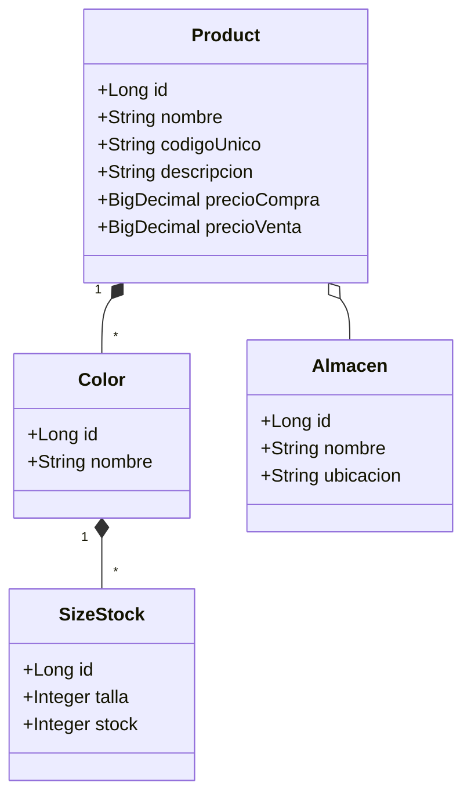

**📦 Sistema de Ventas y Gestión de Calzados**

> **Un sistema moderno y completo para la gestión de inventario y ventas de calzado de hombre y mujer, construido con Spring Boot y Angular 19.**

---

## 🚀 Tabla de Contenidos

1. [✨ Descripción](#-descripción)
2. [🛠️ Tecnologías](#️-tecnologías)
3. [🌟 Características Principales](#-características-principales)
4. [📦 Estructura del Proyecto](#-estructura-del-proyecto)
5. [⚙️ Instalación y Ejecución](#️-instalación-y-ejecución)
6. [🗂️ Modelo de Datos](#️-modelo-de-datos)
7. [🖥️ Endpoints y UI](#️-endpoints-y-ui)
8. [🔐 Seguridad y Usuarios](#️-seguridad-y-usuarios)
9. [🤝 Contribuciones](#-contribuciones)
10. [📄 Licencia](#-licencia)

---

## ✨ Descripción

Este sistema permite:

- Registrar **productos de calzado** con múltiples **colores** y **tallas**.
- Gestionar **5 almacenes** para ubicar stock.
- Realizar **ventas con facturación**, generando números de factura únicos.
- Consultar stock por **código o serie**, con actualización dinámica tras cada venta.
- Control de **roles** (*ADMIN*, *USUARIO*) para acceso seguro.

Ideal para tiendas de zapatos que buscan automatizar su inventario y proceso de venta. 👠👞

---

## 🛠️ Tecnologías

- **Backend**: Spring Boot 3, Spring Data JPA, Spring Security (JWT)
- **Frontend**: Angular 19, RxJS, Angular Material
- **Base de Datos**: MySQL / PostgreSQL
- **Generación de PDF**: iText
- **Contenedores**: Docker (opcional)
- **Documentación API**: Swagger/OpenAPI

---

## 🌟 Características Principales

- 🎨 **Productos con Colores & Tallas**: Cada producto puede tener varios colores, y cada color múltiples tallas con stock individual.
- 🏬 **Múltiples Almacenes**: Cinco almacenes configurables para dividir y localizar inventario.
- 🛒 **Gestión de Ventas**: Descuento automático de stock, generación de factura en PDF.
- 🔍 **Búsqueda Inteligente**: Localiza productos por código o serie única.
- 🔒 **Seguridad**: Autenticación JWT, control de rutas según rol.
- 📈 **Dashboard**: Resumen de ventas, stock bajo, productos más vendidos.

---

## 📦 Estructura del Proyecto

```
inventario-ventas-zapatos/
├── backend/
│   ├── src/main/java/com/zapateria/
│   │   ├── config/       # Seguridad, Swagger, CORS
│   │   ├── controller/   # Endpoints REST
│   │   ├── dto/          # Data Transfer Objects
│   │   ├── exception/    # Manejo global de errores
│   │   ├── model/        # Entidades JPA
│   │   ├── repository/   # Spring Data JPA
│   │   └── service/      # Lógica de negocio
│   └── src/main/resources/
│       ├── application.yml
│       └── db/migration/ # Liquibase o Flyway
├── frontend/
│   ├── src/app/
│   │   ├── components/   # UI Reutilizable (Angular Material)
│   │   ├── pages/        # Vistas (Productos, Ventas, Stock)
│   │   ├── services/     # Conexión a API REST
│   │   └── models/       # Interfaces TS
│   └── angular.json
└── docker-compose.yml
```

---

## ⚙️ Instalación y Ejecución

1. **Clonar repositorio**:
   ```bash
   git clone https://github.com/tu-usuario/inventario-ventas-zapatos.git
   ```
2. **Configurar Base de Datos** en `application.yml` (URL, usuario, contraseña).
3. **Backend**:
   ```bash
   cd backend
   mvn clean install
   mvn spring-boot:run
   ```
4. **Frontend**:
   ```bash
   cd frontend
   npm install
   ng serve
   ```
5. Abrir en el navegador:
   - API: `http://localhost:8080/swagger-ui.html`
   - App: `http://localhost:4200`

---

## 🗂️ Modelo de Datos



- **Product** ➡️ contiene lista de **Color**.
- **Color** ➡️ lista de **SizeStock** (talla + stock).
- Cada **Product** reside en un **Almacen**.

---

## 🖥️ Endpoints y UI

| Módulo    | Endpoint                    | Descripción                       |
| --------- | --------------------------- | --------------------------------- |
| Productos | `GET /api/products`         | Listar productos                  |
|           | `POST /api/products`        | Crear producto                    |
|           | `GET /api/products/{id}`    | Obtener producto por ID           |
| Stock     | `GET /api/stock?codigo=...` | Buscar stock por código           |
| Ventas    | `POST /api/sales`           | Registrar venta + generar factura |
|           | `GET /api/sales/{id}/pdf`   | Descargar factura PDF             |
| Usuarios  | `POST /api/auth/login`      | Autenticación JWT                 |

En **Angular**, cada módulo (Productos, Ventas, Stock, Usuarios) tiene rutas y componentes dedicados con **Angular Material** para una UX moderna. 🖱️

---

## 🔐 Seguridad y Usuarios

- **Roles**:

  - `ADMIN`: Gestión completa (productos, almacenes, ventas, usuarios).
  - `USUARIO`: Sólo ventas y consulta de stock.

- **Flujo**:

  1. Login con usuario/clave.
  2. Obtención de token JWT.
  3. Inclusión de token en `Authorization: Bearer <token>` en cada petición.

---

## 🤝 Contribuciones

¡Las contribuciones son bienvenidas! 🙌

1. Haz un fork del proyecto.
2. Crea tu feature branch: `git checkout -b feature/nombre-de-feature`
3. Haz commit de tus cambios: `git commit -m 'Agrega nueva feature'`
4. Push a la rama: `git push origin feature/nombre-de-feature`
5. Crea un Pull Request.

---

## 📄 Licencia

Este proyecto está bajo la licencia MIT. ¡Siéntete libre de usarlo y adaptarlo! 📜

